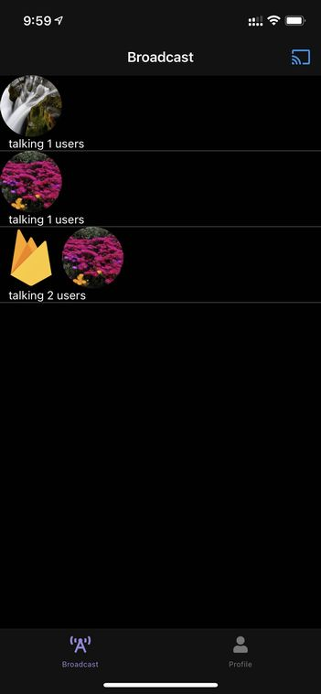
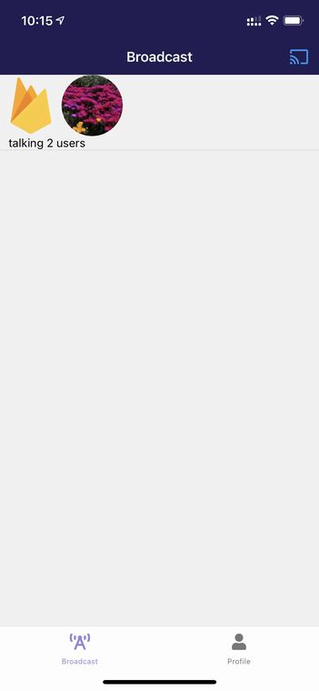
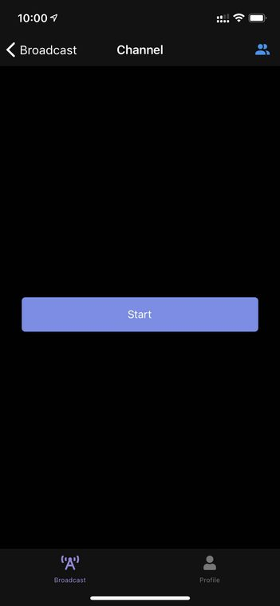
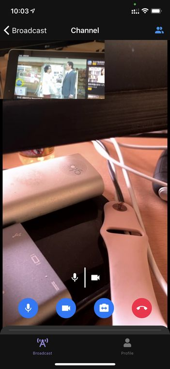
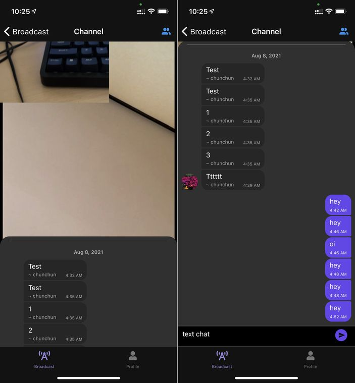
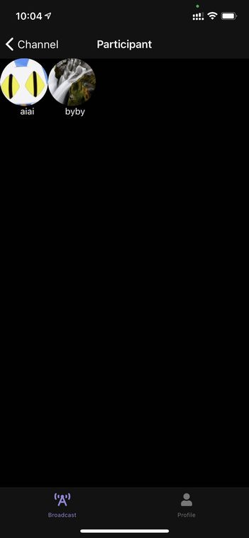
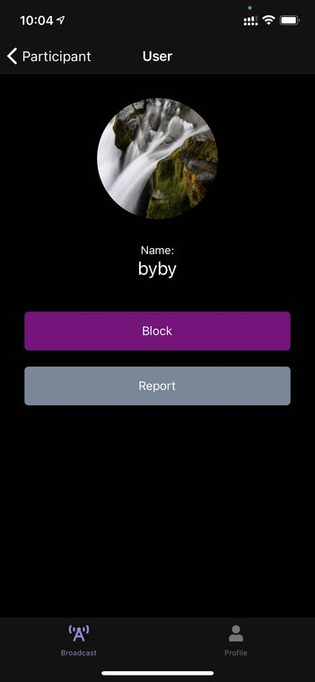

# ビデオチャットに参加しよう

## 会話に参加しよう

ボトムタブの**Broadcast**を開くと現在のチャット部屋一覧が表示されます。並んでいるのは部屋にいるユーザーのアバターです。

タップするとそのチャット部屋に参加できます。

## 会話を始めよう

右上の**Cast**アイコンをタップして自分でチャット部屋を開始することもできます。

## ビデオチャットを始めよう

チャット部屋に入った直後はカメラとマイクはオフになっています。**Start**をタップするとオンになりビデオチャットに参加できます。

## みんなで話そう

ビデオチャットで会話しましょう。

下にあるタグを上に引き上げるとテキストチャットが表示されます。カメラとマイクをオフにしていてもテキストチャットには参加できます。

## 参加者のプロフィールを確認しよう

ビデオチャット画面で右上の**Users**アイコンをタップすると、部屋にいる人を一覧できます。

アバターをタップすると、そのユーザーのプロフィールを確認できます。

